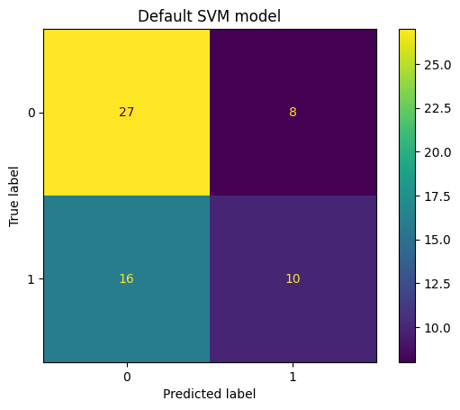

## Berkeley Haas - Professional Certificate in Machine Learning & Artificial Intelligence
# Capstone Project: Peripheral Markers for Angiogenesis and Brain Aging

**Barbara Klein**

## Executive Summary
***Goal:*** The main aim of this analysis was to reproduce the most important results from a recent publication by Torres-Espin et al. (https://doi.org/10.1126/scitranslmed.adk3118) who showed that blood factors related to vascular health provide information about brain health and cognitive function during aging. Additionally, the dataset was used to train and test classifier models for cognitive impairment and the presence of detrimental protein deposits in the brain that play a role in Alzheimer’s disease (amyloid beta plaques).

***Results and Conclusion:*** Principal components identified by an unsupervised principal component analysis in an aged cohort of patients were associated with age and brain function. Blood factors that play a role in vascular health were important contributors to the main principal components, and the amount of specific factors in the blood was related to parameters of brain structure and cognitive function. That means that measuring such blood factors over time might provide information about the brain health during aging, which might open new avenues for diagnosis and prevention of age-related brain disorders.
In addition, this dataset was used to train and test classifier models for cognitive impairment and amyloid beta deposits in the brain. The best performing model for cognitive impairment was a SVM model (test accuracy 0.77 and test recall 0.70), while for amyloid beta deposits in the brain it was a logistic regression model (test accuracy 0.66 and test recall 0.50). This reinforces the idea that angiogenic blood factors together with other patient characteristics might provide information about the status of the brain during aging, which should be confirmed in a bigger patient cohort.

## Rationale
If blood factors that indicate harmful or beneficial trajectories for brain aging can be identified, this could be used for diagnostic and preventative purposes without the need for more complex and expensive methods such as brain imaging.

## Research Question
Do different blood parameters associated with vascular health correlate with factors indicating brain aging (such as presence of amyloid beta, white and grey matter injuries, or worse performance in cognitive tests)?

## Data Sources
The dataset was downloaded from the Open Data Commons for Traumatic Brain Injury platform (https://odc-tbi.org/data/1187; download date January 7, 2025).

*Dataset Citation:* Torres Espin A., Radabaugh H. L., DeCarli C., Kramer J. H., Ferguson A. R., Elahi F. M. (2024) Blood markers of angiogenesis and brain aging trajectories in humans with cognitive impairment. Open Data Commons for Traumatic Brain Injury. ODC-TBI:1187 http://doi.org/10.34945/F53028

*Dataset License:* Creative Commons Attribution License (CC-BY 4.0)

*Originating Publication:* Torres-Espin A, Rabadaugh H, Fitzsimons S, Harvey D, Chou A, Lindberg C, Casaletto KB, Goldberger L, Staffaroni AM, Maillard P, Miller BL, DeCarli C, Hinman JD, Ferguson AR, Kramer JH, Elahi FM (2023). Sexually dimorphic differences in angiogenesis markers predict brain aging trajectories.bioRxiv. https://doi.org/10.1101/2023.07.16.549192.

*Final Publication:* Torres-Espin A, Rabadaugh H, Fitzsimons S, Harvey D, Chou A, Lindberg C, Casaletto KB, Goldberger L, Staffaroni AM, Maillard P, Miller BL, DeCarli C, Hinman JD, Ferguson AR, Kramer JH, Elahi FM (2024).Sexually dimorphic differences in angiogenesis markers are associated with brain aging trajectories in humans.Sci Transl Med 16(775). https://doi.org/10.1126/scitranslmed.adk3118

The analysis that was done for this project follows in part what was done by Torres-Espin and colleagues in the final publication.

## Methodology
After data clean up and handling of missing values, a principal component (PC) analysis was used to identify patterns in the patient population. Then the relative contribution of individual blood factors to the main PCs was calculated. Next, linear mixed models were used to analyze if  the main PCs actually correlated with aging and clinical parameters assessing brain function. This was followed by a similar analysis of individual blood factors that contributed to the main PCs and had shown an association with aging.
Next, different classifier models were tested to predict (1) cognitive impairment and (2) the presence of amyloid beta deposits (protein aggregates that are thought to be involved in the disease mechanism of Alzheimer’s disease) in the brain. The first step was to split the datasets into training and testing datasets. After transformation of categorical variables and data scaling, the following classifier models were trained and tested:

Dummy model to establish a baseline for model performance
Logistic regression
K nearest neighbor (KNN)
Decision tree
Support vector machine (SVM)

The GridSearchCV was used on the models that performed best for each outcome parameter to further optimize these models regarding their recall, which would maximize the chances of identifying patients needing further diagnostics or interventions. The detailed data modeling steps and their results can be found in the Jupyter notebook.

## Results
### Understanding the Objective
The goal of this analysis was to find out if measuring factors related to vascular health and angiogenesis in the peripheral blood can provide information about the likely status of the brain (such as accumulation of amyloid beta, injuries to white or grey matter) and cognitive function in aging patients. Measuring blood factors is faster and cheaper than doing brain scans or cognitive assessments, and thus would save time and money, and ideally such blood markers could not only be used to diagnose, but to monitor the effect of treatment interventions.

### Data and Feature Understanding
The original dataset contained 2568 entries with information about 435 patients collected during up to 20 hospital visits per patient. The mean age of the patients in the dataset was 74 years across all visits (71 years at the time of their first hospital visit for this study).
The first task was to understand how the dataset was structured and which parameters were available across hospital visits per patient. Of the 435 patients in the dataset, 63 patients only had a first visit, and less than half of the patients had more than five visits. The angiogenesis blood factors (bFGF, FLT1, PlGF etc) were not assessed during the first visit for a lot of patients, so focusing only on the data from this visit did not seem to be a good option. 

Also during the other hospital visits there were quite a few missing values that needed to be dealt with. In contrast to what was done in the original publication by Torres-Espin et al., it was decided not to fill in the missing values, but to use the means across different hospital visits for each patient instead. After removing missing values, this dataset still contained data from 203 patients with a complete set of parameters.
For later testing of classification models, two outcome parameters were chosen: (1) Cognitive impairment and (2) amyloid beta deposits in the brain. The analysis of cognitive impairment was based on the Clinical Dementia Rating (CDR) scale global score which is a parameter assessing cognitive impairment and dementia. Study participants were considered to be functionally normal with no evidence of cognitive impairment or dementia if they had a CDR global score of 0. In the remaining data, 106 patients did not show any signs of cognitive impairment (CDR global = 0), whereas 97 did at least have some impairment in the CDR score.
Amyloid beta deposits are aggregates of misfolded proteins that are a feature of Alzheimer’s disease and are thought to be involved in disease progression. The distribution and number of patients with/without amyloid beta deposits (89 to 114 respectively) as identified using positron emission tomography (PET) scans also seemed suitable for analysis.

## Data Modeling
### Correlation Matrix
As a first step, a correlation matrix of the parameters selected for analysis was generated. There were only weak correlations between age, the individual blood parameters and the total Clinical Dementia Rating (CDR) score. The biggest negative correlations were, as expected, between the total CDR score and the composite score for executive function (-0.51) and the hippocampus volume (-0.29), and the biggest positive correlations were between the amyloid beta status (0.35) and the ApoE E4 status and the vascular disease score (VDS) (both 0.22).
For executive function, amyloid beta deposits in the brain, as well as volumes of hippocampus and white matter, the situation is similar with only weak correlations to the individual blood factors.

### Principal Component Analysis and Contribution of Each Blood Parameter to the Main Principal Components
Similar to the analysis by Torres-Espin and colleagues, first a PCA was run and the contribution of the individual blood factors to the main principal components was analyzed.

Even though a slightly different approach was used than in Torres-Espin et al. (no filling of missing values, mean instead of median, linear instead of non-linear PCA because of the easier interpretability and possibly better correlation to later linear mixed models, PCA on the whole dataset not only on blood factors) the overall pattern of how much the different blood factors contribute to PC1 and PC2 was similar, but not exactly the same.
In Torres-Espin et al. the top four blood factors contributing positively to PC1 were PIGF, FLT1 (VEGFR1), VEGFC, and VEGFA, whereas in the present analysis these factors were the top four blood factors: VEGFA (negative), VEGFC (negative), VEGFD (positive), and bFGF (positive). Other parameters with high relative contributions to PC1 were, for example, the vascular disease score and white matter volume.
In Torres-Espin et al. the top four blood factors contributing to PC2 were Tie2 (negative), bFGF (positive), VEGFC (positive) FLT1 (VEGFR1) (negative). In contrast, in the present analysis the top contributors among blood factors were: PlGF (positive), FLT1 (VEGFR) (positive), Tie2 (negative), and VEGFC (negative).

### Linear Mixed Models to Check if PC1 and PC2 Correlate with Age and Brain Parameters in Both Sexes
Next, Torres-Espin et al., used linear mixed models (LMM) to check if PC1 and PC2 actually correlated with age and different parameters for brain structure and function in both male and female patients, which was also done for this analysis.

Similar to the analysis by Torres-Espin et al., there was a significant relationship of PC1 and PC2 with age, sex and age x sex.

Additionally, PC1 and PC2 were associated with parameters assessing brain structure and cognitive function (such as white matter volume, hippocampus volume and executive function scores), similar to what was described in Torres-Espin et al.

### Linear Mixed Models to Analyze Association Between Angiogenesis Blood Factors that Contributed to Main Principal Components and Aging/Sex Clinical Parameters for Brain Structure and Function
Next, Torres-Espin and colleagues used linear mixed models (LMM) to show how specific blood factors that were identified in the unsupervised PCA analysis correlated with clinical parameters assessing brain structure and cognitive function.

For this LMM analysis, a new dataframe was generated that did not include the mean values calculated across different visits, but the actual data from each visit per patient. After removing missing values and outliers, the cleaned up dataframe still contained data from 240 patients. This LMM analysis focused on the top 4 factors with the highest positive and negative contribution to PC1 and PC2, respectively.

Of the top four blood parameters with the highest contribution to PC1 (VEGFA, VEGFC, VEGFD and bFGF) and PC2 (PlGF, FLT1, Tie2 and VEGFC) the following had a significant association with age, but not with sex or age x sex: bFGF, PlGF, FLT1 (VEGFR1), Tie2.

Similarly, Torres-Espin and colleagues showed a highly significant relationship between age and the following blood factors: PlGF, FLT1 (VEGFR1) and bFGF, and also did not find a significant association with age x sex.

### Linear Mixed Models to Analyze Association Between Angiogenesis Blood Factors that Contributed to Main Principal Components and Aging/Sex Clinical Parameters for Brain Structure and Function
Next, two of these angiogenesis blood factors, bFGF and PlGF, that were identified as important contributors to the main principal components and that were significantly associated with aging were further analyzed in LMMs to investigate their relationship with parameters for brain structure and cognitive function.

Sex and FGF x sex had a significant effect on white matter volume. More bFGF in the blood seemed to be beneficial for white matter volume, but only in male patients. Additionally, there was a trend that higher PlGF values seem detrimental in both sexes.

Neither bFGF nor PlGF in the blood had a significant effect on hippocampus volume or executive function. For the clinical dementia score there seemed to be some relationship with PlGF x sex, but because of the discrete distribution of the CDR scores, an LMM might not be the best model. This dementia parameter was further analyzed in the following sections.

In summary, the LMM analysis of the relationship of the identified principal components, and angiogenic blood factors and patient characteristics such as age, sex and parameters for brain structure and function overall yielded similar results as described in the original publication by Torres-Espin and colleagues. Some differences might be explained by slightly different methodologies. In the original publication by Torres Espin et al., the main findings were confirmed in a second dataset that is not publicly available. Instead, for the present analysis the dataset was used to test different classifier models for cognitive impairment and the presence of amyloid beta plaques in the brain.

### Test Classifier Models for Amyloid Beta Status in the Brain and Cognitive Impairment
Different models were trained and tested to find out if the parameters included in the dataset with the calculated means for each patient across hospital visits were enough to predict amyloid beta status in the brain and cognitive function.

For the classification of amyloid beta status in the brain, the parameter which shows the presence/absence of amyloid beta deposits in the brain based on PET imaging was used, and for cognitive impairment, the patients were divided into those with a total Clinical Dementia Rating above/below zero (with 0 indicating an unimpaired cognitive function). For the analysis of cognitive impairment, results from all other cognitive tests were removed from the dataset.

First, the data was split into train and test datasets, and then Dummy pipelines were used as baseline before testing basic logistic regression, default KNN, default Decision Tree and default SVM models. 

### Testing models for classification of cognitive impairment (CDR total > 0)

Among the tested models, all performed better than the Dummy pipeline and the model with the best test accuracy and recall was the default SVM model. Basic logistic regression was the second best model, followed by the default KNN algorithm, while the default Decision Tree model had the worst test accuracy and recall.

|Dataset Version|Model|Fit Time|Train Accuracy|Test Accuracy|Train Recall|Test Recall|
|---|---|---|---|---|---|---|
|Cognitive Impairment Status|Dummy Pipeline|0\.0117|0\.5282|0\.5082|0\.0000|0\.0000|
|Cognitive Impairment Status|Basic Logistic Regression|0\.0194|0\.8169|0\.7541|0\.7761|0\.6667|
|Cognitive Impairment Status|Default KNN algorithm|0\.0095|0\.8732|0\.7541|0\.8060|0\.6000|
|Cognitive Impairment Status|Default Decision Tree|0\.0136|1\.0000|0\.6721|1\.0000|0\.5333|
|Cognitive Impairment Status|Default SVM model|0\.0159|0\.9225|0\.7705|0\.9254|0\.7000|

To get a better idea of the feature importance the coefficients of the basic logistic regression model were graphed.

The coefficients of the basic logistic regression model predicting cognitive impairment showed that the factors which contributed the most to a higher likelihood for cognitive impairment were amyloid beta in the brain, vascular risk score (VRS), having an APOE e4 allele (meaning carrying a specific version of the APOE gene that is associated with an increased risk of having amyloid beta deposits in the brain and developing Alzheimer's disease), and the vascular disease score (VDS). After that the first angiogenesis blood factor, VEGFC, appeared in the list, followed by age, VEGFD and PlGF. Factors reducing the likelihood for cognitive impairment were longer education, higher hippocampus volume and being female followed by the blood angiogenesis factors, Tie2, VEGFA, FLT1 and bFGF.

That means while angiogenesis blood factors do contribute to the model predicting cognitive impairment, there other, previously described, factors which seem to have more influence, such as amyloid beta deposits in the brain and vascular risk factors which increase the risk and longer education which lowers the likelihood of developing cognitive impairment.

Since the default SVM and basic logistic regression models performed best for the prediction of cognitive impairment, a GridSearchCV was performed to optimize hyperparameters of these models. Recall was used as a scoring parameter, since it seemed important to identify as many patients as possible who are at risk for cognitive impairment or amyloid beta deposits to allow for additional diagnostic tests or interventions.
While optimizing the hyperparameters improved the test accuracy and recall of the logistic regression model, the  SVM model (C: 1, gamma: scale, kernel: rbf) still performed better with a test accuracy of 0.77 and a test recall of 0.70.

|Dataset Version|Model|Optimized for|Train Accuracy|Test Accuracy|Train Recall|Test Recall|
|---|---|---|---|---|---|---|
|Cognitive Impairment Status|LogisticRegression|recall|0\.7887|0\.6885|0\.7761|0\.6333|
|Cognitive Impairment Status|SVC|recall|0\.9225|0\.7705|0\.9254|0\.7000|

### Testing models for classification of amyloid beta deposits in the brain

Overall, the prediction of amyloid beta deposits in the brain worked less well than the prediction of cognitive impairment, even though all tested models performed better than the dummy model.

|Dataset Version|Model|Fit Time|Train Accuracy|Test Accuracy|Train Recall|Test Recall|
|---|---|---|---|---|---|---|
|Amyloid Brain Status|Dummy Pipeline|0\.0130|0\.5563|0\.5738|0\.0000|0\.0000|
|Amyloid Brain Status|Basic Logistic Regression|0\.0141|0\.7746|0\.6066|0\.7302|0\.4231|
|Amyloid Brain Status:|Default KNN algorithm|0\.0094|0\.7394|0\.6885|0\.5238|0\.4231|
|Amyloid Brain Status|Default Decision Tree|0\.0242|1\.0000|0\.5738|1\.0000|0\.2308|
|Amyloid Brain Status|Default SVM model|0\.0204|0\.8944|0\.6066|0\.7619|0\.3846|

The model with the best test accuracy and recall was the default KNN algorithm. The second best model was the basic logistic regression model which had the same test recall as the KNN model, but a slightly worse accuracy, followed by the default SVM model which had the same test accuracy as the KNN model, but a slightly worse test recall.

To get a better idea of the importance of the individual parameters, the coefficients of the basic logistic regression model were graphed.
![Amyloid Beta LogReg Coefficients (abeta_logreg_coeff.png)

As expected, the presence of the ApoE E4 allele was an important factor increasing the likelihood of amyloid beta deposits in the brain. This factor was followed by the vascular disease score (VDS), the total Clinical Dementia Rating (CDR) score, VEGFD, being female and VEGFA. Among the factors reducing the likelihood for amyloid beta deposits were the composite score for executive function, age, Tie2, PlGF, and FLT1.
While GridSearch CV improved the performance of all three models, the optimized logistic regression model was the best with a test recall of 0.50 and a test accuracy of 0.66. This optimization of the hyperparameters did not affect the overall ranking of the parameters in the model, but the weights of their contributions.

|Dataset Version|Model|Optimized for|Train Accuracy|Test Accuracy|Train Recall|Test Recall|
|---|---|---|---|---|---|---|
|Amyloid Brain Status|LogisticRegression|recall|0\.7958|0\.6557|0\.7619|0\.5000|
|Amyloid Brain Status|SVC|recall|0\.8028|0\.6066|0\.7460|0\.4231|
|Amyloid Brain Status|KNeighborsClassifier|recall|1\.0000|0\.6230|1\.000|0\.5000|

## Conclusion
The present analysis showed similar results as the original publication by Torres-Espin et al.: An unsupervised principal component analysis in an aged cohort of patients yielded principal components that were associated with age, and parameters for brain structure and function. Blood factors associated with vascular health were important contributors to the main principal components and also associated with age, brain structure and cognitive function. This shows that tracking such angiogenic blood factors over time might yield information about the brain health during aging.
Additionally, this dataset was used to train and test classifier models for cognitive impairment and amyloid beta deposits in the brain. The best performing model for cognitive impairment was a SVM model (test accuracy 0.77 and test recall 0.70), while for amyloid beta deposits in the brain it was a logistic regression model (test accuracy 0.66 and test recall 0.50).

## Next steps
To confirm these observations, it would be important to repeat this analysis in a larger cohort of patients. Additionally, it would be interesting to compare the performance of these models to ensemble techniques such as Bagging (for example, with the Random Forest algorithm) or Boosting.

## Outline of project
- [Link to notebook](Capstone_final.ipynb)
